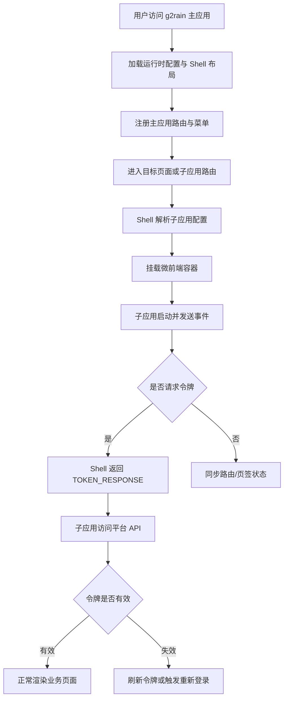



  

# g2rain-main-shell

下一代AI软件开发范式，AI原生Agent平台，开源的企业级SaaS底座。

微前端主应用与平台前端运行壳，负责子应用挂载、卸载与运行容器编排；维护 Shell 层路由映射、菜单导航与页面跳转；协调登录态、令牌事件、SSO 回调与登出流程；配套 Nginx 与环境配置脚本支撑容器化部署

[官网](https://www.g2rain.com) · [Issues](https://github.com/g2rain/g2rain/issues) · [Discussions](https://github.com/g2rain/g2rain/discussions)

## 目录

- 项目简介
- 平台定位
- 应用角色
- 功能概览
- 使用场景
- 核心流程
- 流程图
- 技术栈
- 环境要求
- 快速开始
- 配置说明
- 构建与镜像
- 代码质量与测试
- 运行示例
- 安全说明
- 与关联仓库的关系
- 模块说明
- 职责边界
- 常见问题
- 关联仓库
- 参与贡献
- 许可证
- 联系我们
- 致谢

## 项目简介

微前端主应用与平台前端运行壳，负责子应用挂载、卸载与运行容器编排；维护 Shell 层路由映射、菜单导航与页面跳转；协调登录态、令牌事件、SSO 回调与登出流程；配套 Nginx 与环境配置脚本支撑容器化部署

## 平台定位

该仓库位于 g2rain 前端应用层，是平台的微前端主应用。 它与 g2rain-iam 等应用、工具或支撑服务共同协作。 它为平台提供 Shell 层布局、路由入口与子应用编排能力。

本项目正式采用中央 `frontend-shell 1.0.0`，并以 `frontend-app 1.0.0` 作为通用前端基础；它是当前唯一主应用实现和该 Profile 的首个正式验证对象。项目事实和采用状态见 [docs/project.yaml](docs/project.yaml)，文档入口见 [docs/index.md](docs/index.md)。

## 应用角色

该仓库聚焦于 `前端 Shell、子应用编排与平台导航`。

核心对象包括：
- 菜单
- 令牌
- 路由
- 子应用

主要流程包括：
- Shell 启动与路由映射注册流程
- 子应用挂载与卸载生命周期流程
- 子应用路由同步流程
- 令牌请求、响应与失效事件流程
- Qiankun 运行时初始化与多实例子应用编排流程

## 功能概览

| 能力 | 说明 |
| --- | --- |
| 微前端容器 | 提供 Shell 级运行容器，承载平台前端子应用的挂载、卸载与页面承载。 |
| 路由与菜单编排 | 维护 Shell 层路由映射、菜单结构与子应用跳转关系，统一平台入口体验。 |
| 认证态协同 | 处理 SSO 回调、令牌请求、登出与失效事件，协调 Shell 与子应用之间的登录态。 |
| 运行时启动编排 | 通过 boot 模块组织路由、微前端、国际化、Mock 与页面初始化流程。 |
| 容器化前端部署 | 提供 Nginx 模板与入口脚本，支撑运行时环境变量注入和静态资源部署。 |

## 使用场景

| 场景 | 说明 |
| --- | --- |
| 平台统一前端入口 | 当多个平台基础应用或业务应用需要共享统一导航、布局、页签与工作区时，由主应用提供入口容器。 |
| 微前端子应用装载 | 当 manager、infra、department、cms 等应用需要作为子应用接入平台时，由 Shell 负责挂载、卸载与生命周期衔接。 |
| 登录态与令牌协同 | 当子应用需要访问平台 API 或感知登录失效时，由 Shell 统一处理令牌存储、校验、刷新与事件分发。 |
| 跨应用路由与页签联动 | 当子应用内路由变化需要同步到主应用菜单、页签或浏览器路径时，由 Shell 维护路由状态。 |

## 核心流程

| 流程 | 关键步骤 | 代码线索 |
| --- | --- | --- |
| Shell 启动流程 | 加载运行时配置 → 初始化状态管理与路由 → 注册 Shell 路由映射 → 初始化微前端运行环境 → 挂载 Vue 主应用 | src/main.ts、src/runtime/boot、src/runtime/router |
| 子应用装载流程 | 用户进入子应用路由 → Shell 解析目标应用与 activeRule → 创建或复用应用管理器 → 挂载子应用容器 → 子应用进入运行生命周期 | MicroAppPage、BaseAppManager、qiankun、src/platform/apps |
| 令牌事件协同 | 子应用发送 REQUEST_TOKEN → Shell 校验并读取当前令牌 → Shell 返回 TOKEN_RESPONSE → 子应用携带令牌访问平台服务 → TOKEN_INVALID 触发失效处理 | src/components/micro-app/types.ts、event-windows-adapter.ts、message-processor.ts |
| 接口请求与令牌刷新 | 请求拦截器读取令牌 → 访问令牌有效则注入 Authorization → 令牌过期时进入刷新屏障 → 刷新成功后重放请求 → 刷新失败进入认证失败流程 | src/components/http/interceptors、src/components/http/refresh-barrier.ts、token.store.ts |

## 流程图

## 技术栈

| 类别 | 说明 |
| --- | --- |
| 运行时 | Node.js、npm |
| 前端框架 | vue、vue-router、pinia、vue-i18n、element-plus |
| 构建与类型 | vite、typescript、vue-tsc |
| 微前端 | qiankun |
| 接口与模拟 | axios、mockjs、vite-plugin-mock |
| 部署 | Docker、Nginx |

## 环境要求

- Node.js >=22
- npm
- Docker

## 快速开始

| 步骤 | 命令或位置 | 说明 |
| --- | --- | --- |
| 安装依赖 | `npm ci` | 根据 package-lock.json 安装锁定依赖。 |
| 本地开发 | `npm run dev` | 启动微前端 Shell，本地联调子应用、路由与登录态流程。 |
| 构建产物 | `npm run build` | 执行类型检查与前端构建，生成可发布产物。 |
| 预览产物 | `npm run preview` | 在本地预览构建后的前端产物。 |
| 容器化 | `docker build .` | 仓库提供 Dockerfile，可按组织镜像规范封装前端运行镜像。 |

## 配置说明

### 运行配置

| 配置项 | 说明 |
| --- | --- |
| `VITE_*` | 前端运行时环境变量，通常由 Vite 与部署环境共同注入。 |

### 路由配置

| 配置项 | 说明 |
| --- | --- |
| `Context Path` | 用于控制前端应用在平台或子路径下的访问基准路径。 |

### 部署配置

| 配置项 | 说明 |
| --- | --- |
| `nginx/default.conf.template` | 容器运行时 Nginx 配置模板，用于静态资源访问和请求转发。 |

### 平台集成配置

| 配置项 | 说明 |
| --- | --- |
| `认证与令牌配置` | Shell 需要与 IAM、网关或平台认证链路保持登录态、令牌刷新与登出行为一致。 |

## 构建与镜像

| 目标 | 命令 | 产物 | 说明 |
| --- | --- | --- | --- |
| 本地开发 | `npm run dev` | 本地开发服务 | 启动微前端 Shell，便于联调子应用与登录态流程。 |
| 前端产物 | `npm run build` | `dist` | 执行类型检查与 Vite/TypeScript 构建，生成可发布产物。 |
| 产物预览 | `npm run preview` | 本地预览服务 | 在本地预览构建后的前端静态产物。 |
| 容器镜像 | `docker build .` | 前端运行镜像 | 基于 Dockerfile 封装静态前端运行镜像。 |
| 构建脚本 | `./build.sh` | 脚本定义的构建结果 | 执行仓库提供的构建脚本，承载组织内镜像或发布流程。 |

## 代码质量与测试

| 检查项 | 命令 | 说明 |
| --- | --- | --- |
| 代码风格 | `npm run lint` | 执行 ESLint 或项目定义的前端代码风格检查。 |
| Vue 类型检查 | `npm run build` | 构建流程中使用 vue-tsc 检查 Vue 与 TypeScript 类型。 |

## 运行示例

| 示例 | 方法 | 路径 | 用途 | 调用示例 |
| --- | --- | --- | --- | --- |
| 启动主应用本地联调 | 示例 | `npm run dev` | 启动 g2rain 主应用，用于联调 Shell 路由、微前端装载和登录态协同。 | `npm run dev` |
| 构建主应用静态产物 | 示例 | `npm run build` | 生成可部署到 Nginx 或容器镜像中的前端静态资源。 | `npm run build` |
| 子应用请求主应用令牌 | 示例 | `g2rain:sub-app:request-token` | 子应用通过标准事件向 Shell 请求当前访问令牌。 | `g2rain:sub-app:request-token` |
| 子应用通知路由变化 | 示例 | `g2rain:sub-app:route-change` | 子应用通过标准事件通知 Shell 同步浏览器路径、菜单或页签状态。 | `g2rain:sub-app:route-change` |

## 安全说明

| 主题 | 说明 |
| --- | --- |
| 令牌注入 | 接口拦截器会将有效访问令牌注入 Authorization 请求头，子应用不应自行绕过 Shell 的令牌协同规则。 |
| 令牌失效处理 | 访问令牌过期时需要通过统一刷新屏障避免并发刷新；刷新失败时应进入统一认证失败或重新登录流程。 |
| 跨应用消息 | Shell 与子应用之间的消息应使用约定事件类型与结构化数据，避免非标准消息进入核心处理流程。 |
| 访问路径边界 | 微前端 activeRule、Context Path 与部署路径需要一致，避免子应用资源或回调路径被错误解析。 |

## 与关联仓库的关系

本仓库作为 g2rain 前端微应用体系的主应用，与各业务子应用及平台基础前端应用协同完成统一布局、路由编排、登录态传递与子应用装载。

## 模块说明

| 模块 | 职责说明 | 代码线索 |
| --- | --- | --- |
| Shell 布局与导航 | 提供平台主应用布局、菜单、页签、头部与主工作区。 | src/shell/layout、src/shell/components、src/shell/pages |
| 运行时启动编排 | 组织路由、微前端、国际化、Mock 与页面启动流程。 | src/runtime/boot |
| 路由与访问控制 | 维护平台路由、子应用跳转、认证守卫与重定向流程。 | src/runtime/router、src/views/redirect |
| 微前端装载 | 负责子应用挂载容器、生命周期衔接与 Shell 到子应用的运行时协同。 | MicroAppPage、micro-app.boot、qiankun |
| 部署运行配置 | 提供 Nginx 配置模板与容器入口脚本，支撑静态资源部署和环境变量注入。 | nginx/default.conf.template、nginx/docker-entrypoint.sh、Dockerfile |

## 职责边界

该仓库主要负责：
- 负责前端交互与应用流程
- 负责 Shell 层布局、路由入口与子应用编排
- 负责 Shell 到子应用之间的令牌与路由同步事件协调

该仓库默认不负责：
- 不负责子应用内部的具体业务逻辑
- 不替代后端认证或平台服务职责
- 不负责后端服务逻辑

## 常见问题

| 问题 | 可能原因 | 处理建议 |
| --- | --- | --- |
| 子应用无法加载 | activeRule、子应用入口地址或部署路径与 Shell 路由配置不一致。 | 检查子应用注册配置、Context Path、Vite base 与 Nginx 静态资源路径。 |
| 子应用拿不到 token | 子应用未按约定发送 REQUEST_TOKEN，或 Shell 当前登录态无有效访问令牌。 | 检查微前端事件类型、消息结构、登录回调与 token.store 状态。 |
| 接口请求反复 401 或刷新失败 | 访问令牌过期、刷新令牌失效或 IAM Token 端点配置不正确。 | 检查 VITE_TOKEN_END_POINT、认证回调配置、刷新屏障日志与网关返回的错误码。 |
| 容器部署后页面刷新 404 | Nginx 静态资源回退或前端 base/context path 配置不匹配。 | 检查 nginx/default.conf.template、运行时环境变量和前端路由 history fallback。 |

## 关联仓库

| 仓库 | 协作关系 |
| --- | --- |
| g2rain-iam | 协同完成登录认证、令牌发放、SSO 回调或前端登录态衔接。 |
| g2rain-manager-app | 采用 `frontend-app 1.0.0` 的真实子应用，用于验证挂载、路由、Token、Locale 和卸载契约。 |
| g2rain-gateway-webflux | 为业务 API 提供统一入口、后端鉴权和请求转发。 |

## 工程文档

- [文档导航](docs/index.md)
- [架构偏差](docs/architecture/deviations.md)
- [配置与部署](docs/operations/configuration.md)
- [安全边界](docs/security/security-boundaries.md)
- [需求入口](docs/requirements/README.md)

## 参与贡献

我们欢迎所有形式的贡献：Issue 反馈、文档改进、功能建议与代码提交。

推荐流程：

1. Fork 本仓库。
2. 创建特性分支：`git checkout -b feature/your-feature-name`。
3. 提交更改：`git commit -m "Add some feature"`。
4. 推送分支：`git push origin feature/your-feature-name`。
5. 提交 Pull Request。

代码贡献前请尽量补充必要的测试和文档，并确保构建、测试与静态检查通过。

## 许可证

本项目基于 [Apache 2.0许可证](https://github.com/g2rain/g2rain-common/blob/main/LICENSE) 开源。

## 联系我们

- Issues: [GitHub Issues](https://github.com/g2rain/g2rain/issues)
- 讨论: [GitHub Discussions](https://github.com/g2rain/g2rain/discussions)
- 邮箱: g2rain_developer@163.com

## 致谢

感谢所有为 g2rain 项目提交 Issue、代码、文档、建议和使用反馈的开发者们！

